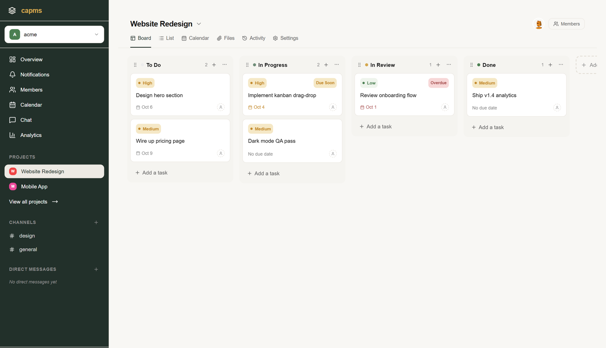
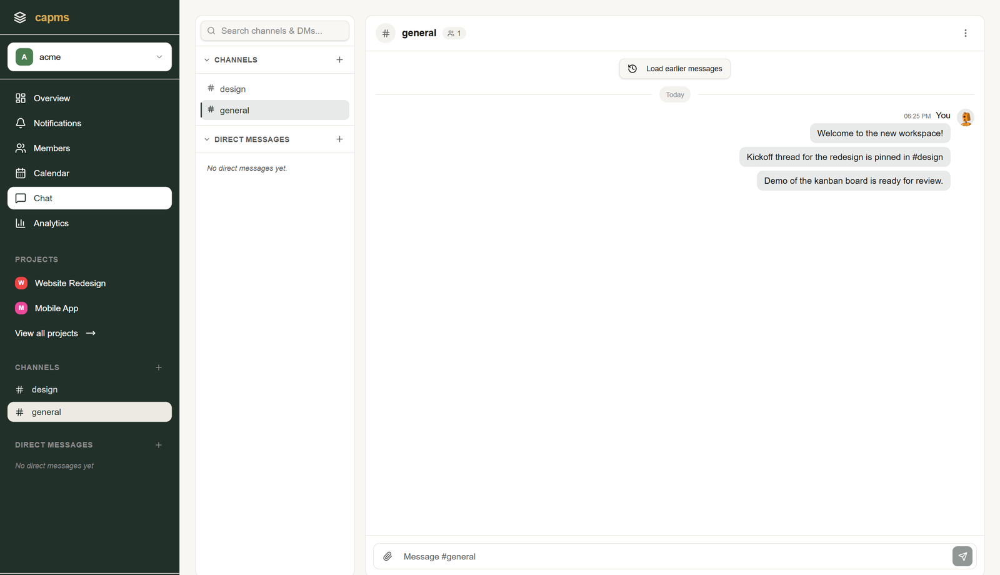
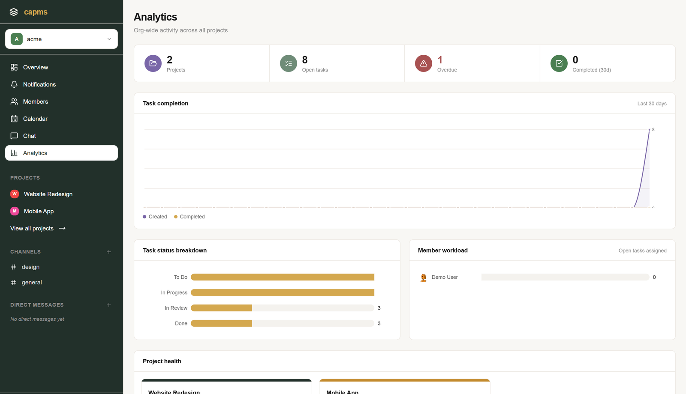
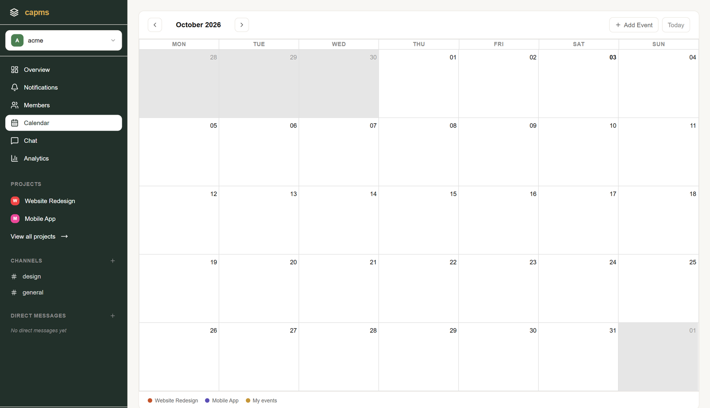
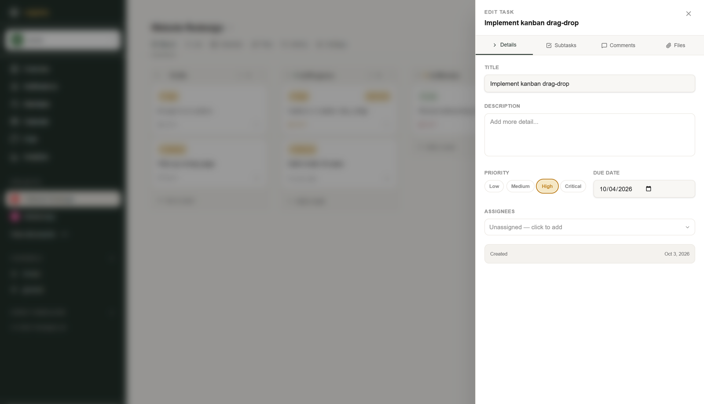

# capms — Team Collaboration & Project Management System

<div align="center">

[](https://nextjs.org/)
[](https://react.dev/)
[](https://www.typescriptlang.org/)
[](https://nodejs.org/)
[](https://www.postgresql.org/)
[](https://redis.io/)
[](https://www.docker.com/)
[](LICENSE)

<p align="center">
  A production-ready, multi-tenant SaaS workspace combining Kanban boards, team chat, calendars, notifications, and organization analytics into a unified developer-friendly platform.
</p>

[Features](#-key-features) • [Preview](#-preview) • [Architecture](#-architecture) • [Tech Stack](#-tech-stack) • [Quick Start](#-quick-start) • [API Docs](#-api-documentation)

</div>

---

## 📸 Preview

<div align="center">
  
  <p><em>Interactive Drag-and-Drop Kanban Board with priority flags, due date badges, and task details</em></p>
</div>

<br />

| Team Chat & Channels | Organization Analytics |
|:---:|:---:|
|  |  |
| **Personal & Project Calendar** | **Task Drawer & Subtasks** |
|  |  |

---

## ⚡ Key Features

- 📋 **Interactive Kanban Boards:** Fluid drag-and-drop task movement powered by `@dnd-kit`, customizable columns, priorities (`LOW`, `MEDIUM`, `HIGH`, `CRITICAL`), attachments, comments, and subtasks.
- 💬 **Real-Time Team Communication:** Channels and 1-on-1 Direct Messages via Socket.IO with typing indicators, reactions, unread counts, and notifications.
- 📅 **Integrated Calendar:** Personal calendar and project milestone tracking in month, week, and day views (`react-big-calendar`).
- 📊 **Org Analytics & Workload:** Interactive charts powered by Recharts tracking completion velocity, priority distributions, and individual workload.
- 🏢 **Multi-Tenant Organizations:** Isolated organization workspaces, slug-based routing (`/org/[slug]`), and workspace switching.
- 🛡️ **Role-Based Access Control (RBAC):** Granular permissions for Organization Owner, Org Admin, Project Manager, and Member, plus a platform-wide **Super Admin Console**.
- 🔔 **Activity Feed & Notifications:** Real-time push notifications for task assignments, channel mentions, and due date alerts.
- ⏳ **Background Queue & Reminders:** Redis + BullMQ workers processing delayed due-date reminders and transactional emails via Resend.
- 🔐 **Secure Authentication:** HttpOnly cookie-based JWT sessions, refresh token rotation, email verification, and OAuth (Google & GitHub).

---

## 🏗️ Architecture

The repository is structured as a decoupled monorepo containing independent backend and frontend services sharing zero code and interacting exclusively over a RESTful API and WebSockets:

```
├── backend/                  # Express 5 REST API (RMVCS Architecture)
│   ├── src/
│   │   ├── config/           # Environment, database, cookies, and redis configuration
│   │   ├── controllers/      # Request handlers & response formatting
│   │   ├── middlewares/      # Auth, RBAC, error handling, rate limiting
│   │   ├── models/           # Sequelize ORM models
│   │   ├── repositories/     # Database access & query layer
│   │   ├── routes/           # Versioned REST endpoints (/api/v1) with Swagger JSDoc
│   │   ├── services/         # Business logic & external service integrations
│   │   ├── socket/           # Real-time WebSocket event gateways
│   │   └── workers/          # BullMQ queue jobs & email processors
│   └── src/sequelize/        # Database migrations & seeds
│
├── frontend/                 # Next.js 16 App Router Client
│   ├── public/               # Static assets & landing preview graphics
│   └── src/
│       ├── app/              # App router routes & protected layouts
│       ├── components/       # UI components, dashboard layout, modals, drawers
│       ├── hooks/            # TanStack Query & mutation hooks
│       ├── lib/              # Axios instance, socket client, utilities
│       ├── schemas/          # Zod validation schemas
│       ├── services/         # Typed API client services
│       └── store/            # Zustand client state stores (Auth, Org, Chat)
│
└── docker-compose.yml        # Orchestration for Frontend, Backend, Postgres & Redis
```

---

## 🛠️ Tech Stack

### Frontend
- **Framework:** Next.js 16 (App Router, Turbopack) & React 19
- **State Management:** TanStack Query v5 (Server state) & Zustand (Client state)
- **Styling:** Tailwind CSS v4, Radix UI primitives, Lucide Icons
- **Forms & Validation:** React Hook Form & Zod
- **Drag & Drop:** `@dnd-kit/core` & `@dnd-kit/sortable`
- **Charts & Calendar:** Recharts & React Big Calendar

### Backend
- **Runtime & Server:** Node.js 20+, Express 5, TypeScript
- **Database & ORM:** PostgreSQL 15+ & Sequelize ORM (strict migrations)
- **Caching & Queues:** Redis 7+ & BullMQ
- **Real-Time:** Socket.IO
- **Storage & Email:** Cloudinary (Attachments) & Resend (Transactional emails)
- **Documentation:** Swagger UI / OpenAPI 3.0 JSDoc

---

## 🚀 Quick Start

### Option 1: Run with Docker Compose (Recommended)

Make sure you have [Docker & Docker Compose](https://www.docker.com/) installed.

1. **Clone the repository:**
   ```bash
   git clone https://github.com/Ishan-Pradhan/Team-Collaboration-and-Project-Management-System.git
   cd Team-Collaboration-and-Project-Management-System
   ```

2. **Configure backend environment:**
   Create `backend/.env` with your credentials (see [Environment Variables](#-environment-variables)).

3. **Start the entire stack:**
   ```bash
   docker compose up --build
   ```

4. **Access services:**
   * **Frontend Application:** `http://localhost:3000`
   * **Backend REST API:** `http://localhost:8080/api/v1`
   * **Interactive Swagger Docs:** `http://localhost:8080/api/docs`
   * **PostgreSQL:** `localhost:5433`
   * **Redis:** `localhost:6381`

---

### Option 2: Run Locally (Without Docker)

#### Prerequisites
* Node.js 20+
* PostgreSQL 15+
* Redis 7+

#### 1. Backend Setup
```bash
cd backend
npm install

# Run database migrations
npx sequelize-cli db:migrate

# Start development server
npm run dev
# Server running at http://localhost:8080
```

#### 2. Frontend Setup
```bash
# Open a new terminal
cd frontend
npm install

# (Optional) Create frontend/.env.local if changing backend port
# NEXT_PUBLIC_API_URL=http://localhost:8080/api/v1

# Start Next.js development server
npm run dev
# App running at http://localhost:3000
```

---

## ⚙️ Environment Variables

### Backend (`backend/.env`)

| Variable | Description | Default / Example |
| :--- | :--- | :--- |
| `PORT` | API server port | `8080` |
| `NODE_ENV` | Runtime environment | `development` / `production` |
| `DB_HOST` | PostgreSQL host | `localhost` (or `db` in Docker) |
| `DB_PORT` | PostgreSQL port | `5432` |
| `DB_NAME` | Database name | `capms_db` |
| `DB_USER` | Database user | `postgres` |
| `DB_PASSWORD` | Database password | `your_db_password` |
| `REDIS_URL` | Redis connection URI | `redis://localhost:6379` |
| `ACCESS_TOKEN_SECRET` | Secret key for JWT access tokens | `your_access_secret` |
| `ACCESS_TOKEN_EXPIRES_IN` | Access token lifespan | `15m` |
| `REFRESH_TOKEN_SECRET` | Secret key for JWT refresh tokens | `your_refresh_secret` |
| `REFRESH_TOKEN_EXPIRES_IN` | Refresh token lifespan | `7d` |
| `FRONTEND_URL` | Frontend URL for CORS and email links | `http://localhost:3000` |
| `RESEND_API_KEY` | Resend API key for transactional emails | `re_123456789` |
| `EMAIL_FROM` | Sender email address | `noreply@yourdomain.com` |
| `CLOUDINARY_CLOUD_NAME` | Cloudinary cloud name | `your_cloud_name` |
| `CLOUDINARY_API_KEY` | Cloudinary API key | `your_api_key` |
| `CLOUDINARY_API_SECRET` | Cloudinary API secret | `your_api_secret` |
| `GOOGLE_CLIENT_ID` | Google OAuth Client ID | `your_google_client_id` |
| `GOOGLE_CLIENT_SECRET` | Google OAuth Client Secret | `your_google_client_secret` |
| `GOOGLE_CALLBACK_URL` | Google OAuth Callback URL | `http://localhost:8080/api/v1/auth/google/callback` |
| `GITHUB_CLIENT_ID` | GitHub OAuth Client ID | `your_github_client_id` |
| `GITHUB_CLIENT_SECRET` | GitHub OAuth Client Secret | `your_github_client_secret` |
| `GITHUB_CALLBACK_URL` | GitHub OAuth Callback URL | `http://localhost:8080/api/v1/auth/github/callback` |

### Frontend (`frontend/.env.local`)

| Variable | Description | Default |
| :--- | :--- | :--- |
| `NEXT_PUBLIC_API_URL` | Backend API base endpoint | `http://localhost:8080/api/v1` |

---

## 📖 API Documentation

Interactive OpenAPI/Swagger documentation is built directly into the backend:
* **Interactive UI:** Visit [`http://localhost:8080/api/docs`](http://localhost:8080/api/docs)
* **Raw OpenAPI JSON Spec:** [`http://localhost:8080/api/docs.json`](http://localhost:8080/api/docs.json)

Endpoints are organized into modular domains:
- 🔑 **Auth & OAuth:** Registration, login, Google/GitHub OAuth, session refresh, email verification, password reset.
- 🏢 **Organizations:** CRUD, slug lookup, member invitations, role management, member bans.
- 📁 **Projects & Kanban:** Project settings, columns, tasks, drag-reordering, assignments, comments, attachments.
- 💬 **Channels & Direct Messages:** Channel creation, messaging, read receipts, reactions, typing status.
- 🔔 **Notifications:** User activity feed, unread counter, read status updates.
- 📅 **Personal Events:** Custom reminders, personal deadlines, event schedules.
- 🛡️ **Super Admin:** Global platform statistics, tenant management, user moderation, audit logs.

---

## 🗄️ Database Migrations

Database schemas are strictly managed using Sequelize CLI migrations (no hazardous auto-sync):

```bash
cd backend

# Run pending migrations
npx sequelize-cli db:migrate

# Rollback most recent migration
npx sequelize-cli db:migrate:undo

# Generate a new migration
npx sequelize-cli migration:generate --name your-migration-name
```

---

## 📜 Available Scripts

### Backend (`cd backend`)
* `npm run dev` — Starts backend server with hot-reloading via `tsx`
* `npx tsc --noEmit` — Type-checks all backend TypeScript code

### Frontend (`cd frontend`)
* `npm run dev` — Runs Next.js development server with Turbopack
* `npm run build` — Validates TypeScript and creates optimized production bundle
* `npm run start` — Serves production build locally
* `npm run lint` — Runs ESLint checks

---

## 📄 License
 
This project is open source and available under the [MIT License](LICENSE).
Copyright © 2026 Ishan Pradhan.
